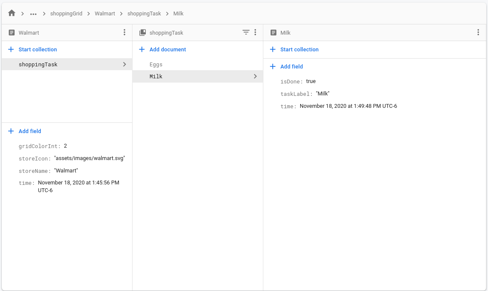

# Yaanyo
Real time chat and shopping checklist made with flutter utilizing Firebase and Cloud Firestore as backend.

## Screenshots
    
 
    

## Features
- Real time chat with family and friends.
- Catagorize shopping tasks by colored grids.
- Easily add tasks to shopping list on the go.

## Packages used
- [Provider](https://pub.dev/packages/provider)
- [Firebase Core](https://pub.dev/packages/firebase_core)
- [Firebase Auth](https://pub.dev/packages/firebase_auth)
- [Cloud Firestore](https://pub.dev/packages/cloud_firestore)
- [Flutter SVG](https://pub.dev/packages/flutter_svg)
- [Get_It](https://pub.dev/packages/get_it)
- [Flutter Material Color Picker](https://pub.dev/packages/flutter_material_color_picker)

## Overview of how it works
- Authenticate via email and password managed by [Firebase Auth](https://pub.dev/packages/firebase_auth).
- If successful, log user in and upload user name, email, profile pic, and UID to [Cloud Firestore](https://pub.dev/packages/cloud_firestore) for safe keeping and easy access.
- To achieve "real time" interactivity, we are heavily utilizing [Stream](https://api.flutter.dev/flutter/dart-async/Stream-class.html) and [StreamBuilder](https://api.flutter.dev/flutter/widgets/StreamBuilder-class.html) everywhere possible.
- Streams. Streams everywhere.

## Cloud Firestore Data Structure
    

## Installation
Install by either sideloading attacked [APK file](https://github.com/KhalidWar/yaanyo/releases) on your android device or by building project from source following steps below.

### Getting Started
Check out [Flutter's official guide](https://flutter.dev/docs/get-started/install) to installing and running flutter.

### Prerequisites
- Download an IDE either [Android Studio](https://developer.android.com/studio) or [VSC](https://code.visualstudio.com/)
- Install Flutter SDK and Dart plugin
- Emulator or physical device

### Steps
- Clone this repo to your machine: `https://github.com/KhalidWar/yaanyo.git`
- Run on Emulator or physical device
- Sign up for an account
- All set!

## License
This project is licensed under [MIT Licnese](https://github.com/KhalidWar/yaanyo/blob/master/LICENSE).

## Acknowledge
Some profile pictures used in this projects are obtained from [Unplash](https://unsplash.com/).
